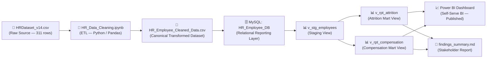

# HR Analytics — Data Dictionary & Lineage Documentation

> **Purpose:** Schema reference and data lineage for the HR Analytics reporting pipeline.
> Intended for analysts, engineers, and auditors who consume downstream reports.
> **Prepared by:** Ashay Vairat

---

## 📐 Data Lineage

The diagram below traces the full journey of data from the raw source through to the self-serve dashboard consumed by stakeholders.

**Lineage Summary:**

| Layer | Asset | Tool | Description |
|-------|-------|------|-------------|
| Source | `HRDataset_v14.csv` | — | Raw HR dataset, 311 rows, 29 columns |
| Transform | `HR_Data_Cleaning.ipynb` | Python / Pandas | ETL: null handling, schema normalization, deduplication |
| Canonical | `HR_Employee_Cleaned_Data.csv` | — | Validated, transformed dataset; input to all downstream systems |
| Storage | `HR_Employee` table in `HR_Employee_DB` | MySQL | Relational reporting layer; queryable by all consumers |
| Modeling | `v_stg_employees`, `v_rpt_attrition`, `v_rpt_compensation` | MySQL Views | Layered reporting views (staging → marts) |
| Reporting | `HR Dashboard.pbix` | Power BI | Self-serve BI dashboard for HR Operations and Finance |
| Narrative | `findings_summary.md` | Markdown | Non-technical stakeholder report with key insights |

---

## 📋 Table Schema: `HR_Employee`

**Database:** `HR_Employee_DB`
**Table:** `HR_Employee`
**Primary Key:** `EmpID`
**Row Count (post-load):** 311
**Source:** `HR_Employee_Cleaned_Data.csv`

| Column | Data Type | Nullable | Source Field | Business Definition |
|--------|-----------|----------|-------------|---------------------|
| `EmpID` | INT | ❌ No | `EmpID` | Unique employee identifier. Primary key. |
| `Employee_Name` | VARCHAR(255) | ❌ No | `Employee_Name` | Full name of the employee (Last, First format). |
| `Sex` | VARCHAR(5) | ❌ No | `Sex` | Reported gender: `M` or `F`. |
| `MaritalDesc` | VARCHAR(255) | ✅ Yes | `MaritalDesc` | Marital status: Single, Married, Divorced, Widowed, Separated. |
| `DeptID` | INT | ❌ No | `DeptID` | Numeric identifier for the employee's department. Foreign key to department reference. |
| `FromDiversityJobFairID` | INT | ❌ No | `FromDiversityJobFairID` | Binary flag: `1` = hired through a Diversity Job Fair; `0` = standard recruitment. |
| `Salary` | DECIMAL(10,2) | ❌ No | `Salary` | Annual gross salary in USD. Used in compensation equity and budget reporting. |
| `Position` | VARCHAR(255) | ❌ No | `Position` | Job title / role. Used for position-level compensation analysis. |
| `State` | VARCHAR(255) | ✅ Yes | `State` | US state of employee's work location. |
| `Zip` | VARCHAR(255) | ✅ Yes | `Zip` | ZIP code of work location. |
| `DOB` | DATE | ✅ Yes | `DOB` | Date of birth. Stored as `DATE` after ETL conversion from `MM/DD/YYYY`. |
| `CitizenDesc` | VARCHAR(255) | ✅ Yes | `CitizenDesc` | Citizenship status: US Citizen, Eligible NonCitizen, Non-Citizen. |
| `HispanicLatino` | VARCHAR(255) | ✅ Yes | `HispanicLatino` | Self-reported ethnicity indicator: `Yes` or `No`. |
| `RaceDesc` | VARCHAR(255) | ✅ Yes | `RaceDesc` | Self-reported race/ethnicity category. |
| `DateofHire` | DATE | ❌ No | `DateofHire` | Date employee joined the organisation. Converted from `MM/DD/YYYY` by ETL. Used for tenure calculation. |
| `DateofTermination` | DATE | ✅ Yes | `DateofTermination` | Date employment ended. NULL for active employees. Converted from `MM/DD/YYYY`; blank strings set to NULL. |
| `TermReason` | VARCHAR(255) | ✅ Yes | `TermReason` | Reason for termination (e.g., Another position, Unhappy, More money). `N/A-StillEmployed` for active staff. |
| `EmploymentStatus` | VARCHAR(255) | ❌ No | `EmploymentStatus` | Current status: `Active`, `Voluntarily Terminated`, or `Terminated for Cause`. |
| `Department` | VARCHAR(255) | ❌ No | `Department` | Business unit: Production, IT/IS, Sales, Software Engineering, Admin Offices, Executive Office. |
| `ManagerName` | VARCHAR(255) | ✅ Yes | `ManagerName` | Full name of the reporting manager. |
| `ManagerID` | INT | ✅ Yes | `ManagerID` | EmpID of the reporting manager. Self-referential foreign key within `HR_Employee`. |
| `RecruitmentSource` | VARCHAR(255) | ✅ Yes | `RecruitmentSource` | Hiring channel: Indeed, LinkedIn, Google Search, Employee Referral, Diversity Job Fair, CareerBuilder, Website, Other. |
| `PerformanceScore` | VARCHAR(255) | ❌ No | `PerformanceScore` | Latest performance rating: `Exceeds`, `Fully Meets`, `Needs Improvement`, `PIP`. |
| `EngagementSurvey` | FLOAT | ✅ Yes | `EngagementSurvey` | Engagement score from annual survey. Scale: 1.0–5.0. Dataset average: 4.11. |
| `EmpSatisfaction` | INT | ✅ Yes | `EmpSatisfaction` | Self-reported satisfaction score. Scale: 1–5. Dataset average: 3.89. |
| `SpecialProjectsCount` | INT | ✅ Yes | `SpecialProjectsCount` | Number of special projects the employee participated in during the review period. |
| `LastPerformanceReview_Date` | DATE | ✅ Yes | `LastPerformanceReview_Date` | Date of last formal performance review. Converted from `MM/DD/YYYY` by ETL. |
| `DaysLateLast30` | INT | ✅ Yes | `DaysLateLast30` | Number of days the employee arrived late in the last 30 days. Used as punctuality/attendance indicator. |
| `Absences` | INT | ✅ Yes | `Absences` | Total number of absence days recorded. Used in attendance and absence-adjusted cost analysis. |

---

## 🔗 Reporting Views Reference

Three SQL views sit on top of the `HR_Employee` table, implementing a staging → reporting mart pattern. See [`sql/views/hr_reporting_views.sql`](sql/views/hr_reporting_views.sql).

| View | Layer | Purpose |
|------|-------|---------|
| `v_stg_employees` | Staging | Cleaned, typed base layer — all consumers read from this, not directly from the raw table |
| `v_rpt_attrition` | Reporting Mart | Attrition rates, termination reasons, and retention metrics by department |
| `v_rpt_compensation` | Reporting Mart | Salary benchmarks, gender pay equity metrics, and outlier flags by department |

---

## 🔎 Data Quality Rules

These rules are enforced via the reconciliation framework in [`HR_Analytics.sql`](HR_Analytics.sql).

| Rule | Applies To | Constraint |
|------|-----------|------------|
| Primary key uniqueness | `EmpID` | Must be unique; no duplicates permitted |
| Non-null critical fields | `EmpID`, `Employee_Name`, `Department`, `Salary`, `EmploymentStatus`, `DateofHire`, `PerformanceScore` | Must not be NULL post-load |
| Termination date logic | `DateofTermination` | Must be > `DateofHire` where not NULL |
| Future hire date | `DateofHire` | Must be ≤ current date |
| Status consistency | `EmploymentStatus` + `DateofTermination` | Active employees must have NULL termination date; terminated employees must have a date |
| Referential integrity | `ManagerID` | Must map to an existing `EmpID` where not NULL |
| Salary range | `Salary` | Values > 3σ from mean flagged for manual review |
| Source-to-target row count | All rows | Loaded count must equal 311 (source CSV row count) |

---

## 📦 ETL Transformation Log

The following transformations were applied during the ETL phase (`HR_Data_Cleaning.ipynb`) before data was loaded into MySQL:

| Field | Raw Format | Transformed Format | Transformation Applied |
|-------|-----------|-------------------|----------------------|
| `DOB` | `MM/DD/YYYY` string | `DATE` | `str_to_date(@DOB, '%m/%d/%Y')` |
| `DateofHire` | `MM/DD/YYYY` string | `DATE` | `str_to_date(@DateofHire, '%m/%d/%Y')` |
| `DateofTermination` | `MM/DD/YYYY` string or blank | `DATE` or NULL | `NULLIF(STR_TO_DATE(...), NULL)` — blank strings set to NULL |
| `LastPerformanceReview_Date` | `MM/DD/YYYY` string | `DATE` | `str_to_date(@LastPerformanceReview_Date, '%m/%d/%Y')` |
| `ManagerID` | Missing / blank | Filled INT | Logical imputation based on ManagerName → EmpID lookup |
| Column order | Arbitrary raw order | Reporting-optimized order | Columns reordered for dashboard and query usability |
| Redundant columns | Present in raw | Removed | Non-informative or duplicate fields dropped |

---

*For methodology and full project context, see [README.md](README.md). For reconciliation queries, see [HR_Analytics.sql](HR_Analytics.sql). For key findings, see [findings_summary.md](findings_summary.md).*
